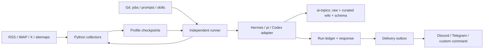

# 設計と実行契約

## 所有境界

| 資産 | 所有先 | 複製方法 |
|---|---|---|
| collector、保守スクリプト、skill、prompt、job、runner | この Git repository | clone + sync-assets |
| Wiki / raw / transcripts / inbox / feeds / hot-topics / .githooks | ai-topics Git repository | clone、未 commit 分は snapshot `--include-content` |
| source cursor / processed IDs / triage / archive metadata / RSS DB | profile | snapshot / restore |
| schedule claims / run result / usage / outbox | `.ai-topics-agent` | snapshot / restore |
| provider / Git / X / messaging credentials | profile の秘密設定と各 tool の auth store | 別経路で provision、snapshot には含めない |
| Hermes sessions / memory / kanban / plugins / browser caches | 任意の harness-specific state | 必要なら harness 側の backup。Wiki 自動化の必須状態ではない |
| model proxy / gateway / dashboard / Cloudflare / o11y exporters | 任意の deployment integration | 選択して別配備 |

## Path ABI

`HERMES_PROFILE_ROOT` → `HERMES_SUBPROCESS_HOME` → `Path.home()` の順で profile を決めます。
Wrapper / runner が subprocess に `HOME=profile`、`HERMES_HOME=profile/.hermes`、
`HERMES_SUBPROCESS_HOME=profile` を渡します。アプリケーションが継承済みの任意の host HOME を前提にすることはありません。

- 内容 repository: `~/ai-topics`
- Wiki: `~/wiki`（relative symlink `ai-topics/wiki`）
- 管理 script: `~/.hermes/scripts`
- 既存 source state: `~/.hermes/processed_*.json`, `~/.hermes/cron/data`
- RSS DB: `~/.blogwatcher/blogwatcher.db`
- 既存出力 ABI: `~/.hermes/cron/output/<legacy-id>/<run>.md` の `## Response`
- 新規 ledger/config/outbox: `~/.ai-topics-agent`

`.hermes` という名称は既存スクリプト・checkpoint と復旧手順との互換性のため残します。
これは Hermes のインストール要件ではありません。将来の形式変更は別の versioned migration として扱います。
Docker mount path は deploy と wrapper の内部だけに閉じ込めます。

## Run lifecycle

1. profile 全体の `flock` を取得（同じ Wiki の index/log/SQLite を同時に書かない）。
2. ledger に running を記録。各 dependency の最新実行が成功しており、26時間以内かつ祖先より新しいことを確認。
3. pre-run script を1回だけ実行。非0 exit または JSON `ok:false`/`error` ならモデルを呼ばず失敗。
4. `wakeAgent:false` なら skip。`no_agent` は stdout が結果。それ以外は共通契約・SOUL・job skill・prompt・script output を adapter に渡す。
5. JSON を要求する triage は response を parse。失敗出力は下流用出力へ公開しない。
6. 応答を共通 run directory と既存互換出力に保存し、outbox に追加。
7. 配信結果と内容処理の成否を別々に記録。秘密変数の値は保存前に redaction。

トークン使用量は adapter の観測値を保存し、未取得は null。旧 prompt の架空の `COST_REPORT` は削除しました。親 process の CODEX_HOME / PI_CODING_AGENT_DIR / XDG config overrides は既定で除外し、明示 local.environment のみ採用します。旧 max_tokens は移行資料として `legacy_max_tokens` に保持し、異なる model/harness に同じ制約として黙って適用しません。実行時間は job の timeout が制約します。

## Scheduler と障害

UTC 5-field cron。日/月曜指定は Vixie cron の OR 規則。`*/2` day-of-month は偶数日ではなく1日起点の step です。
`tick` は保存済み minute cursor から最大1440分の欠落を補完し、job/slot の UNIQUE claim で定時起動の重複を防ぎます。初回と restore は現在時点から開始し、旧ホストの履歴を再実行しません。

モデルや外部サービスの副作用を含む **exactly-once は保証しません**。定時 claim は自動再試行せず、失敗は `status` と run artifacts で確認して明示的に `run <name>` します。プロセスが中断され running が残った場合は scheduler が停止し、`recover <run-id>` で失敗に確定してから判断します。長時間停止の replay を破棄するときは `reset-cursor` を明示します。

checkpoint は pipeline の再開点です。上流が失敗したまま古い出力で成功扱いにしません。外部取得後の crash は再取得しうるため、source ID/URL/SQLite の dedup と immutable raw を維持します。配信は run ID を付ける at-least-once。provider が受理後、ローカル記録前に落ちると重複通知がありえます。

runner lock はこの runner の協調実行を直列化します。別ホスト、手作業や messaging gateway の Wiki 編集まで強制できません。同じ profile/Wiki に同時に別 writer を動かさないことが配備契約です。旧 Hermes cron の有効 job が同じ profile にあると runner は起動を拒否します。

## Capability boundary

必須は「ファイルを読み書きできる agent」「shell」「必要な検索/取得 integration」。
スキルは通常の Markdown と resource file であり、Hermes skill discovery に依存しません。
Hermes 固有 tool 名は共通契約で現ハーネスの同等機能に対応付けます。`delegate_task` は省略して逐次実行可能。通知・cron はモデルから切り離します。
pi の web search は `wiki-search`（Brave API / 任意 argv command）、取得は fetch_article.py / curl。ブラウザが必要なサイトは optional agent-browser 等を設定し、利用できない場合は未取得を明記します。各サービスの認証・API quota・取得制限は可搬性とは別の環境条件です。
